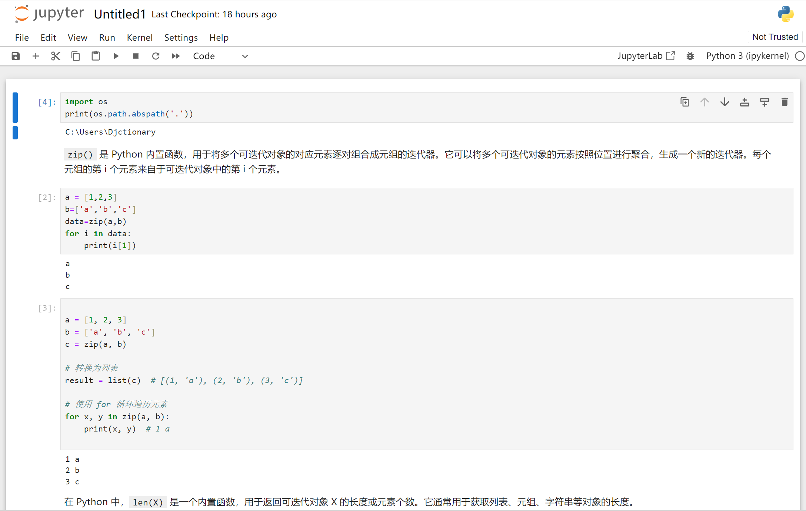
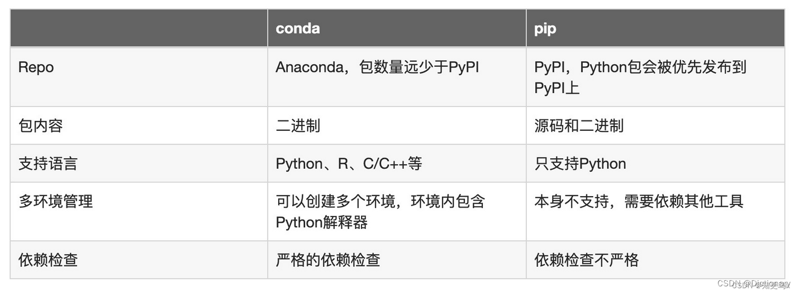

# jupyter notebook
Jupyter Notebook是以网页的形式打开，可以在网页页面中直接编写代码和运行代码，代码的运行结果也会直接在代码块下显示。如在编程过程中需要编写说明文档，可在同一个页面中直接编写，便于作及时的说明和解释。
## 组成部分
1. 网页应用
网页应用即基于网页形式的、结合了编写说明文档、数学公式、交互计算和其他富媒体形式的工具。简言之，网页应用是可以实现各种功能的工具。
2. 文档
即Jupyter Notebook中所有交互计算、编写说明文档、数学公式、图片以及其他富媒体形式的输入和输出，都是以文档的形式体现的。
这些文档是保存为后缀名为.ipynb的JSON格式文件，不仅便于版本控制，也方便与他人共享。
此外，文档还可以导出为：HTML、LaTeX、PDF等格式。
3. Jupyter Notebook的主要特点
 * 编程时具有语法高亮、缩进、tab补全的功能。

  * 可直接通过浏览器运行代码，同时在代码块下方展示运行结果。

   * 以富媒体格式展示计算结果。富媒体格式包括：HTML，LaTeX，PNG，SVG等。

   * 对代码编写说明文档或语句时，支持Markdown语法。

   * 支持使用LaTeX编写数学性说明。


# ipynb文件
 “.ipynb” 文件是使用 Jupyter Notebook 来编写Python程序时的文件。
# pip conda
pip是Python包的通用管理器； conda是一个与语言无关的跨平台环境管理器。pip在任何环境中安装python包；conda需要安装在conda环境中装任何包。

Pip代表Pip Installs Packages，是Python的官方认可的包管理器，最常用于安装在Python包索引（PyPI）上发布的包。

参考资料：
[pip和conda](http://t.csdn.cn/Xw33L)

# anaconda miniconda
**Anaconda和Miniconda的基本概念**

Anaconda和Miniconda都是Continuum Analytics的开源项目，用于管理Python的环境和包。两者都有用于创建和管理虚拟环境的Conda包管理器，这使得在不同的项目之间切换和隔离变得简单。但是，两者之间存在一些重要的区别。

Anaconda是一个包含了conda、Python和超过150个科学包及其依赖项的科学Python发行版。它具有可视化图形用户界面（Anaconda Navigator）并且为了方便新手使用，预先包含了大量的库，如NumPy, Pandas, Scipy, Matplotlib等。

相较之下，Miniconda更加轻量级。它只包含了Python和Conda，但并没有预装其他的库。Miniconda用户需要手动安装他们需要的包，这使得Miniconda的环境更为简洁，可以根据实际需求来安装必要的包，避免不必要的存储占用。

# requirements.txt 
`requirements.txt` 是一个文本文件，用于记录项目的依赖项（Python 包及其对应的版本）。它是一种常见的约定，被许多 Python 项目使用。

**作用**：
- `requirements.txt` 文件的主要作用是简化项目的依赖管理。通过将项目的依赖项列在一个文件中，可以确保在不同的环境中（开发环境、生产环境等）能够重现相同的依赖关系，以确保项目的一致性。
- `requirements.txt` 也方便了其他开发者或部署人员在新环境中安装项目所需的所有依赖项。

**使用方法**：
1. 在项目目录下创建一个名为 `requirements.txt` 的文件。
2. 在文件中，每行写入一个依赖项，格式为 `<package-name>==<version>`。可以使用 `==` 或其他运算符指定所需的版本，如 `<`, `<=`, `>`, `>=` 等。
   例如：```
           requests==2.24.0
           pandas>=1.0.0
           numpy
           ```
3. 运行以下命令安装依赖项：
- 对于仅使用 pip 的项目：
  ```
  pip install -r requirements.txt
  ```
- 对于使用 conda 管理虚拟环境的项目，可以先使用 `pip` 创建一个虚拟环境，然后使用 `conda` 激活虚拟环境并安装依赖项：
  ```
  conda create --name myenv
  conda activate myenv
  pip install -r requirements.txt
  ```

**注意事项**：
- 可以随时更新 `requirements.txt` 文件来添加、删除或更新依赖项。
- 使用确切的版本号可以确保在不同环境中安装相同的依赖项，但也可以只指定大版本号或最低要求版本号，以给予一定的灵活性。
- 可以使用 `pip freeze` 命令生成当前项目的依赖项列表并将其输出到 `requirements.txt` 文件中：
  ```
  pip freeze > requirements.txt
  ```
# setup.py
`setup.py` 是一个 Python 脚本，用于定义和配置一个 Python 包的元数据，以及设置包的安装和分发方式。它通常用于构建和打包 Python 项目，以便在其他环境中安装和使用。

在一个 Python 项目的根目录下，可以创建一个名为 `setup.py` 的文件，并在其中定义项目的元数据和其他相关配置。`setup.py` 文件使用 Python 代码编写，并根据所需的配置项来自定义包的行为。

`setup.py` 文件通常包含以下内容和功能：

1. **元数据定义**：在 `setup.py` 文件中通过设置相应的变量来定义项目的元数据，如包的名称、版本号、作者、描述、依赖项等。这些信息将被用于项目的安装、分发和文档生成等操作。
   例如：
   ```python
   from setuptools import setup, find_packages
   
   setup(
       name='my_package',
       version='1.0.0',
       author='John Doe',
       description='A Python package',
       packages=find_packages(),
       install_requires=['numpy', 'pandas'],
   )
   ```

2. **构建和打包脚本**：`setup.py` 文件还可以定义一些构建和打包的脚本，以指定如何生成和组织包的发布版本。这包括编译代码、复制文件、创建文档等。
   
3. **安装和分发配置**：通过指定一些安装和分发选项，`setup.py` 文件可以定义包的安装和分发方式。这包括打包为源码分发还是二进制分发、设置入口点（entry points）等。
   
4. **其他定制功能**：`setup.py` 文件还可以包含其他自定义功能、钩子或操作，以满足特定项目的需求。

使用 `setup.py` 文件可以根据定义的元数据和配置项，以及所需的定制设置来构建、打包和分发项目。常见的操作方法包括使用命令行工具如 `distutils`、`setuptools` 或 `wheel` 等通过运行 `python setup.py <command>` 来执行构建、打包、安装等操作。

